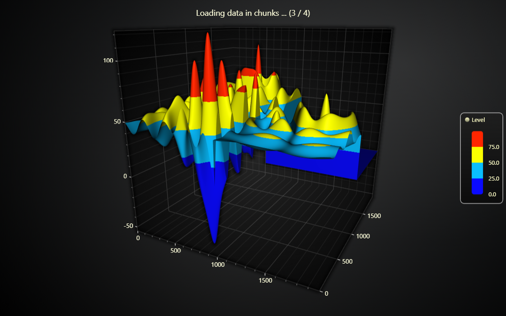

# JavaScript Chunked Surface Grid Chart

This demo application belongs to the set of examples for LightningChart JS, data visualization library for JavaScript.

LightningChart JS is entirely GPU accelerated and performance optimized charting library for presenting massive amounts of data. It offers an easy way of creating sophisticated and interactive charts and adding them to your website or web application.

The demo can be used as an example or a seed project. Local execution requires the following steps:

-   Make sure that relevant version of [Node.js](https://nodejs.org/en/download/) is installed
-   Open the project folder in a terminal:

          npm install              # fetches dependencies
          npm start                # builds an application and starts the development server

-   The application is available at _http://localhost:8080_ in your browser, webpack-dev-server provides hot reload functionality.

## Description

This example showcases how to load a large surface grid chart (several millions and up to billions data points) in small sub sections, instead of one massive interaction.

This is made possible by the _partial data invalidation_ syntax of `invalidateHeightMap` method (also possible with intensity data), which allows updating any rectangular sub section of the heatmap without having to update any extra data.

Loading data in chunks is especially great for memory usage, because in web applications loading large data sets into memory comes with the risk of the browser crashing because there is not enough memory available. By separating the process into chunks, applications can work significantly increased reliability.

# More Surface Examples

-   [Surface Grid Chart (only Y data)](https://lightningchart.com/lightningchart-js-interactive-examples/examples/lcjs-example-0912-surfaceGrid.html) | This example showcases the most simple usage of surface grid series, and also has a bit more detailed description of the related terms.

-   [Intensity Surface Grid Chart](https://lightningchart.com/lightningchart-js-interactive-examples/examples/lcjs-example-0914-surfaceIntensityGrid.html) | This example showcases how surface grid series can be colored based on a different data set than the height map used in this example.

-   [Real-Time Audio Spectrum Surface Chart](https://lightningchart.com/lightningchart-js-interactive-examples/examples/lcjs-example-0913-surfaceScrollingGrid.html) | This example showcases using real-time data source with surface series.

-   [All Surface Examples](https://lightningchart.com/lightningchart-js-interactive-examples/search.html?t=surface)

## API Links

* [3D chart]
* [3D axis]
* [Paletted Fill]
* [Color lookup table]
* [Color RGBA factory]
* [Surface Grid Series]
* [Legend Box]

## Support

If you notice an error in the example code, please open an issue on [GitHub][0] repository of the entire example.

Official [API documentation][1] can be found on [LightningChart][2] website.

If the docs and other materials do not solve your problem as well as implementation help is needed, ask on [StackOverflow][3] (tagged lightningchart).

If you think you found a bug in the LightningChart JavaScript library, please contact sales@lightningchart.com.

Direct developer email support can be purchased through a [Support Plan][4] or by contacting sales@lightningchart.com.

[0]: https://github.com/Arction/
[1]: https://lightningchart.com/lightningchart-js-api-documentation/
[2]: https://lightningchart.com
[3]: https://stackoverflow.com/questions/tagged/lightningchart
[4]: https://lightningchart.com/support-services/

© LightningChart Ltd 2009-2022. All rights reserved.

[3D chart]: https://lightningchart.com/js-charts/api-documentation/v5.1.0/classes/Chart3D.html
[3D axis]: https://lightningchart.com/js-charts/api-documentation/v5.1.0/classes/Axis3D.html
[Paletted Fill]: https://lightningchart.com/js-charts/api-documentation/v5.1.0/classes/PalettedFill.html
[Color lookup table]: https://lightningchart.com/js-charts/api-documentation/v5.1.0/classes/LUT.html
[Color RGBA factory]: https://lightningchart.com/js-charts/api-documentation/v5.1.0/functions/ColorRGBA.html
[Surface Grid Series]: https://lightningchart.com/js-charts/api-documentation/v5.1.0/classes/SurfaceGridSeries3D.html
[Legend Box]: https://lightningchart.com/js-charts/api-documentation/v5.1.0/classes/Chart.html#addLegendBox

